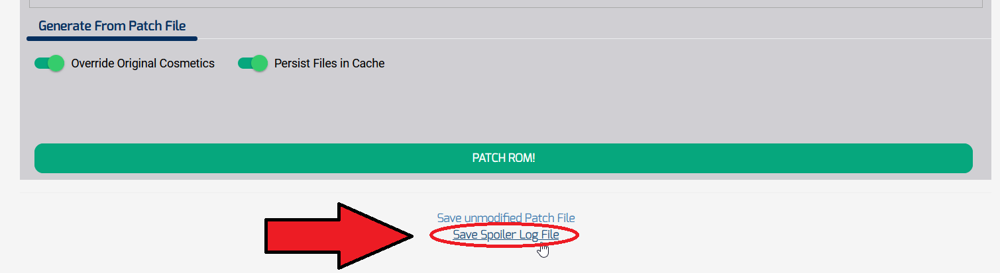

# OoT_RandomizerMappingTool
**WARNING: This project is still in development!** Don't judge me too hard okay, I got it working with python and now I'm just migrating to Javascript :P.

# Description
This tool helps to visualize the randomized map generated with the [Ocarina of Time Randomizer](https://ootrandomizer.com/) v7.1 (by TestRunner et al.) given a seed's spoiler file.

# Usage Instructions
1.  **Generate a seed** by navigating to the [Ocarina of Time Randomizer](https://ootrandomizer.com/) and selecting "Play Now". Adjust the randomization rules as desired then select "GENERATE SEED!" at the bottom of the page.
2. On the following page, select your ROM (this will be a file with the .n64 extension). Scroll down and select "PATCH ROM!", but ***BE SURE to save the spoiler file before closing out of this window!***

3. **Navigate to the [OoT_RandomizerMappingTool](url goes here)**, (hosted on Github Pages).
4. Here you have two options:
    1. Upload your own spoiler file to map your seed! Click the Upload button, navigate to the directory where you saved your spoiler file, and **select your spoiler file**. 
    2. Try the demo! Use a pre-generated spoiler to try out the tool and see how it works. **Click the "Try Demo!" button** to generate the map. 

The program should then generate your map and open it in the central window of the webpage. You can use the tools on the left side of the page to search for and highlight a specific node in the graph, or use the path-finder tool to find and highlight any number of paths from one node to another.

# Other Notes
* ***Spoilers generated with Ocarina of Time Randomizer versions prior to 7.1 are not guaranteed to work***. The developers have changed (and may continue to change) the naming conventions for the spoiler information, and the current parser does not include region names from older versions of the OoT Randomizer.